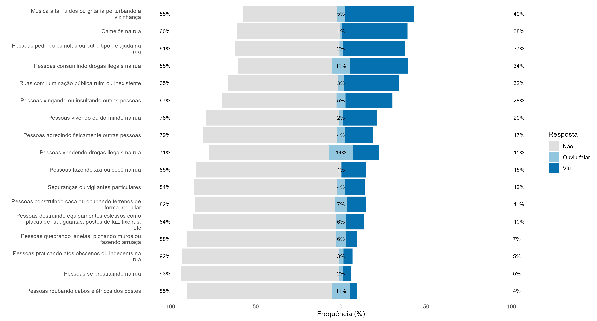

# pesquisa_vitimizacao

Segurança pública é um dos temas mais sensíveis quando falamos em políticas públicas na América Latina, especialmente o Brasil. Devido ao cotidiano de violência e criminalidade, o tema aparece em várias pesquisas de opinião como o mais importante para a população. Contudo, o Brasil ainda não tem o costume de usar dados e evidências empíricas para nortear suas políticas públicas. Neste sentido, até tem-se visto um aumento de ONGs como Fórum Brasileiro de Segurança Pública e Fogo Cruzado que produzem dados de segurança pública, mas ainda é algo embrionário em nosso país. Outro problema é o tipo de dados que temos, apenas estatísticas criminais, ou seja, dados que mostram crimes que já ocorreram, o que dá pouca importância, ou quase nenhuma, às vítiams dos diversos tipos de crimes no Brasil. Uma boa forma de resolver este problema é com as pesquisas de vitimização.

## Desordem

